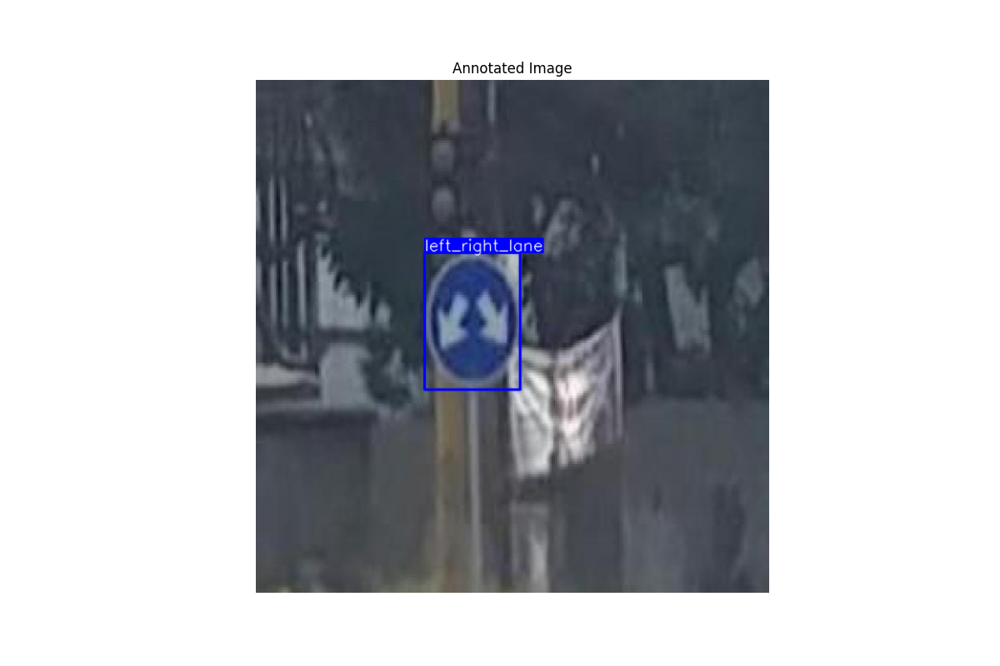

# Отчет по разработке модели детекции дорожных знаков

## Описание модели и этапов разработки

В данном проекте была использована архитектура YOLOv8m для решения задачи детекции дорожных знаков.

Основные этапы разработки:
1. Подготовка данных с использованием Roboflow
2. Обучение модели YOLOv8m на датасете дорожных знаков
3. Валидация и тестирование модели
4. Экспорт модели в различные форматы (ONNX, TorchScript)

Датасет содержит 21 класс дорожных знаков и разделен на:
- Тренировочный набор: 1376 изображений
- Валидационный набор: 488 изображений
- Тестовый набор: 229 изображений

## Метрики на валидационном наборе

Модель показала следующие результаты на валидационном наборе:

- mAP50: 0.967
- mAP50-95: 0.843
- Precision: 0.979
- Recall: 0.940

### Детальные результаты по классам:

| Класс | Precision | Recall | mAP50 | mAP50-95 |
|-------|-----------|--------|--------|-----------|
| do_not_enter | 0.968 | 1.000 | 0.995 | 0.936 |
| do_not_stop | 1.000 | 0.933 | 0.967 | 0.927 |
| do_not_turn_l | 0.981 | 0.971 | 0.994 | 0.915 |
| yellow_light | 0.898 | 0.759 | 0.841 | 0.632 |
| traffic_light | 1.000 | 1.000 | 0.995 | 0.838 |

*Примечание: Показаны некоторые репрезентативные классы*

## Анализ результатов

### Сильные стороны модели:
- Высокая точность (precision) на большинстве классов
- Отличные показатели mAP50 (0.967), что говорит о хорошей способности модели детектировать объекты
- Особенно хорошие результаты на знаках с четкой геометрической формой (например, "do_not_enter")

### Области для улучшения:
- Более низкие показатели для сигналов светофора (особенно желтый свет)
- Некоторая вариативность в recall между классами
- mAP50-95 (0.843) показывает, что есть пространство для улучшения точности локализации

## Примеры работы модели

На изображении выше показан пример работы модели на тестовом изображении. Модель успешно определяет дорожные знаки и отмечает их ограничивающими рамками с указанием класса и уверенности.

## Технические детали

- Размер входного изображения: 640x640
- Batch size: 16
- Количество эпох: 50
- Оптимизатор: Adam
- Устройство обучения: NVIDIA GeForce RTX 4070

## Заключение

Разработанная модель демонстрирует высокую эффективность в задаче детекции дорожных знаков, что подтверждается метриками на валидационном наборе.
